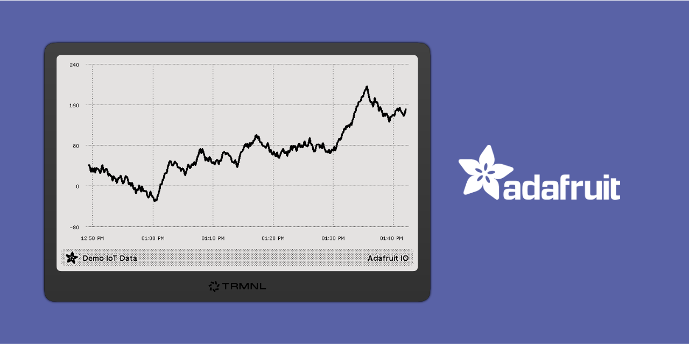
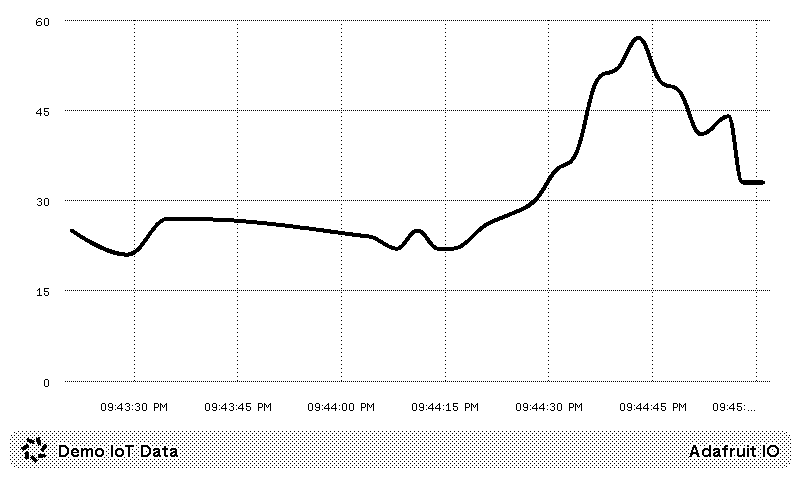

# Adafruit IO for TRMNL

## Screenshots

## Development

### Creating synthetic data

- Create an Adafruit IO project with the slug `demo-iot-data`
- Set the environment variables for `IO_USERNAME` and `IO_KEY`
- Run `./bin/generate_synthetic_data.sh` to generate a data point every 10 seconds
